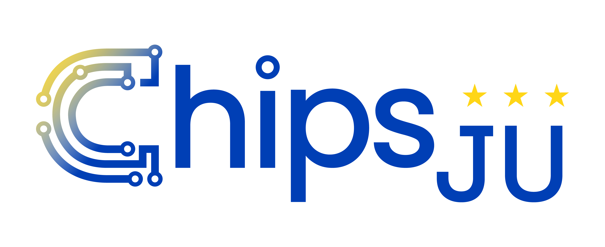

# cosim-gen

Turn a synthesizable RTL design (FIRRTL/`hw`-dialect) into a QEMU/RTL co-simulation:
pick out the peripherals you care about, describe how they wire up in a declarative
`cosim.json`, and `cosim` extracts each one into its own SystemC model, wires it to QEMU
over a remote-port channel, and runs the two together — QEMU executing the CPU/firmware,
your RTL executing the peripheral it's talking to.

## Install

The easiest path is Docker — a self-contained image with the whole toolchain already
built:

```sh
git submodule update --init
docker build -t cosim-gen .
docker run --rm -it --user "$(id -u):$(id -g)" -v "$PWD":/work cosim-gen bash
```

See [`DOCKER.md`](DOCKER.md) for what's inside the image, mounting your own project, and
running this repo's own example/test suite.

To install directly on your host instead — CIRCT, Verilator, `qemu-fdt` (this repo's QEMU
fork), SystemC, `dtc`, `cosim-gen-circt`, see [`INSTALL.md`](INSTALL.md).

## Quick start

```sh
cd example
make               # unpacks the design and builds the firmware it needs (see example/README.md)
cosim build -C cosim.json
cosim run --all
```

`cosim doctor` checks your toolchain is resolved correctly before you run anything for
real. See [`example/README.md`](example/README.md) for what this example actually does.

## Write a `cosim.json`

A `cosim.json` names your design, your platform's device tree, and the peripherals you
want to extract:

```json
{
  "design": {
    "input": "soc.fir",
    "dts": "board.dts",
    "supported_backends": ["verilator"]
  },
  "components": [
    {
      "type": "MyUart", "path": "/Shell/uart",
      "compat": "sifive,uart0",
      "interfaces": [
        { "kind": "clock", "name": "clock", "freq_mhz": 100 },
        { "kind": "reset", "name": "reset" },
        { "kind": "tilelink", "prefix": "auto_control_xing_in", "dir": "slave" },
        { "kind": "interrupt", "prefix": "auto_int_xing_out", "dir": "out" }
      ]
    }
  ]
}
```

Each entry in `components` names an instance in your design (`path`) and the dts node it
should bind to on the QEMU side (`compat` or `dts_path`) — `interfaces` then describes its
clock, reset, bus, and interrupt/gpio ports so `cosim` can wire it to QEMU. Anything you
don't declare is left as a plain signal for your own SystemC code to drive.

`cosim init` scaffolds a starter file; `cosim gen-config` derives `components` from an
existing diplomacy config instead of hand-writing it. The full field-by-field reference —
every `cosim.json` key, the CLI, and how a build/run is structured on disk — lives in
[`cosim-gen-cli/README.md`](cosim-gen-cli/README.md).

## What's here

| Path | What it is |
|---|---|
| [`cosim-gen-cli/`](cosim-gen-cli/README.md) | The `cosim` tool itself: build/run pipeline, `cosim.json` reference, CLI reference. |
| [`cosim-gen-circt/`](cosim-gen-circt/README.md) | The CIRCT/MLIR passes `cosim` drives under the hood (`cosim-extract`, `cosim-gen-opt`). |
| [`example/`](example/README.md) | A worked example: 7 real peripherals extracted from a real Rocket-Chip SoC. |
| [`Dockerfile`](Dockerfile) / [`DOCKER.md`](DOCKER.md) | The self-contained dev/toolchain image. |

## Running the tests

[`run-tests.sh`](run-tests.sh) runs `cosim doctor` and a `cosim build`/`cosim run` pass over every component in [`example/`](example/README.md) — the best single check that a change hasn't broken the pipeline.
Docker image:

```sh
docker run --rm -it --user "$(id -u):$(id -g)" -v "$PWD":/work cosim-gen bash run-tests.sh
```

It works the same directly on a host with the full toolchain resolved (`cosim doctor`
checks that). See [`DOCKER.md`](DOCKER.md#run-this-repos-own-example-suite) for what
each step does.

## Extending

- **Add a peripheral** — no code needed, just a new `components[]` entry in
  `cosim.json` (see [Write a `cosim.json`](#write-a-cosimjson) above).
- **Add a bus protocol** — one new `BusInterface` subclass in
  [`cosim-gen-cli/cosim/interfaces/`](cosim-gen-cli/cosim/interfaces/); see
  [Bus protocols](cosim-gen-cli/README.md#bus-protocols) in the CLI reference.

## License

Apache License 2.0 with LLVM Exceptions — see [`LICENSE`](LICENSE).

## Acknowledgment





Development of this program was partially funded by the German Federal Ministry
of Research, Technology, and Space (BMFTR) within the ChipsJU project ISOLDE
(project number 101112274).
